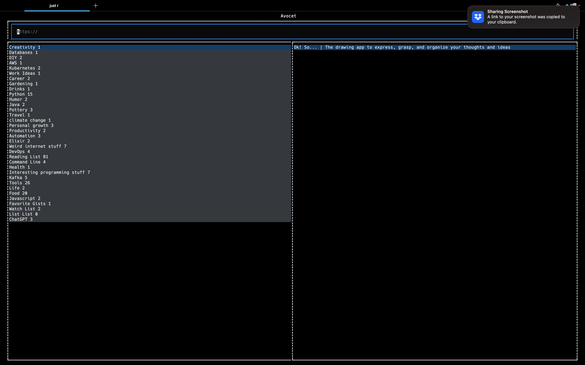

# Avocet

Avocet is a TUI the accesses the [Raindrop API](https://developer.raindrop.io/). It is written in Python and uses the [Textual Framework](https://textual.textualize.io).

## Requirements
- Python 3
- [Poetry](https://python-poetry.org/docs/)
- [Just](https://github.com/casey/just)

## Getting Started
1. Clone the repo
2. Run `just install` or `poetry install` to install dependencies
3. Run `just run` or `poetry run avocet` to run the
4. Tab between sections. Use the arrow keys to navigate within a section. Press enter in the collections section to view the bookmarks in that collection. Press enter on a bookmark to open it in your default browser. Press `ctrl-c` to quit.
5. View the [justfile](./justfile) for more commands.

