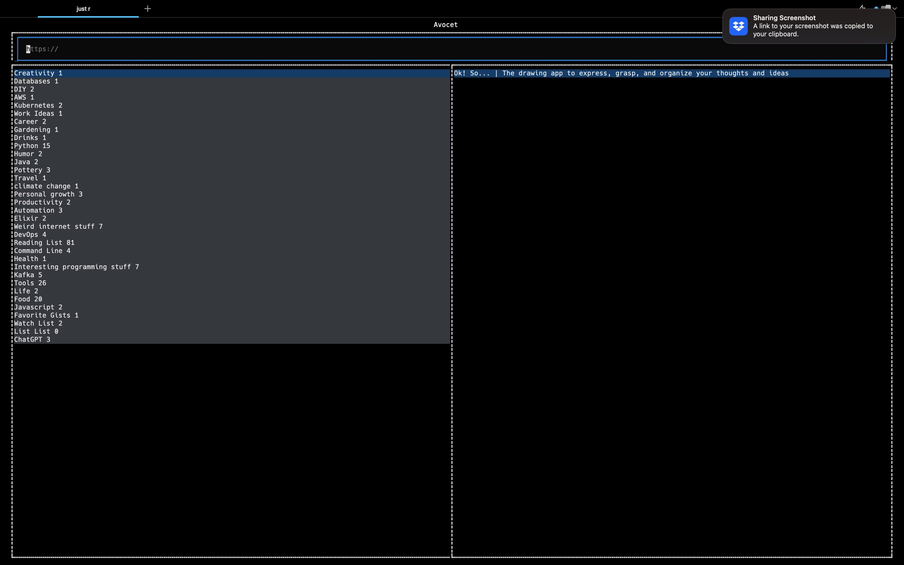

[](https://github.com/JoshuaOliphant/avocet/actions/workflows/python-app.yml)

# Avocet

Avocet is a TUI for browsing your [Raindrop.io](https://raindrop.io) bookmarks. It is written in Python with the [Textual](https://textual.textualize.io) framework. It syncs your collections and bookmarks into a local SQLite cache, generates a concise summary of a bookmark — using either [Anthropic Claude](https://www.anthropic.com/claude) or [OpenAI](https://openai.com) — the first time you open it (cached thereafter), and opens links in your default browser.

## Requirements

- Python 3.12+
- [uv](https://docs.astral.sh/uv/)

## Getting Started

1. Clone the repo.
2. `uv sync` (or `just install`) to install dependencies.
3. Provide the required credentials, either as environment variables or in a `.env`
   file (copy `.env.example` to `.env` and fill it in — exported variables take
   precedence over `.env`):
   - `RAINDROP` — your Raindrop.io API token (from app.raindrop.io/settings/integrations).
   - A summary provider key — set **one** of `ANTHROPIC_API_KEY` or `OPENAI_API_KEY`.
     Avocet auto-detects which to use from the key you provide (Anthropic wins if both
     are set). Override with `AVOCET_SUMMARY_PROVIDER=anthropic|openai`, and the model
     with `AVOCET_SUMMARY_MODEL` (defaults: `claude-haiku-4-5` / `gpt-5-mini`).
4. `just run` (or `uv run textual run --dev avocet/app.py`).
5. Navigate with the arrow keys. Move focus between the collections sidebar and the
   bookmarks table; press Enter on a bookmark to view its details — a Claude summary is
   generated on first view and cached. Useful keys: `o` open in browser, `/` search,
   `a`/`e`/`d` add/edit/delete, `f` filter by tag, `r` refresh from Raindrop, and
   `ctrl+p` for the command palette (including runtime theme switching). `ctrl+c` quits.

Summaries are generated lazily the first time you open each bookmark, so startup is instant.

## Development

Common tasks (see the [justfile](./justfile) for all of them):

```bash
just test            # uv run pytest
just lint            # uv run ruff check .
just typecheck       # uv run ty check
just snapshot-update # regenerate visual snapshot baselines after a UI change
```

The test suite has three layers: unit tests (Raindrop API client and database manager),
interaction tests driven through Textual's `run_test`/`Pilot`, and visual-regression
snapshot tests via `pytest-textual-snapshot`.


